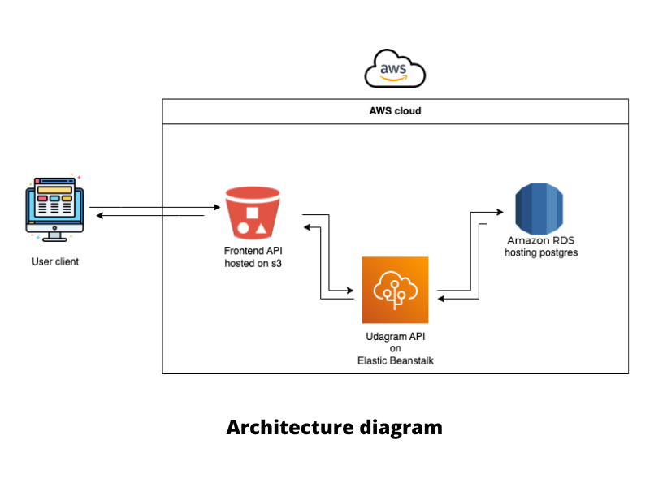

# Udagram

The udagram application is a fairly simple application that includes all the major components of a Full-Stack web application.

### Infrastructure needed

```
- Node v14.15.1 (LTS) or more recent.
- npm 6.14.8 (LTS) or more recent.
- AWS CLI v2.
- A RDS database running Postgres.
- A S3 bucket for static web hosting.
- A EB environment to host the backend API.

```



### Installation

Provision the necessary AWS services needed for running the application:

1. In AWS, provision a publicly available RDS database running Postgres. <Place holder for link to classroom article>
1. In AWS, provision a s3 bucket for hosting the uploaded files. <Place holder for tlink to classroom article>
2. Export the ENV variables needed.
3. From the root of the repo, navigate udagram-api folder `cd starter/udagram-api` to install the node_modules `npm install`. 
4. Without closing the terminal in step 1, navigate to the udagram-frontend `cd starter/udagram-frontend` to intall the node_modules `npm install`.

### Environmental variables

To configure the environmental variables needed locally, create a udagram/set_env.sh file with the below content and set all variables values:

```
export POSTGRES_USERNAME=postgres
export POSTGRES_PASSWORD=
export POSTGRES_HOST=
export POSTGRES_DB=postgres
export AWS_BUCKET=
export AWS_REGION=us-east-1
export AWS_PROFILE=default
export JWT_SECRET=mysecretstring
export URL=http://localhost:4200
```


### Run the application

To run the backend api:
```
cd udagram/udagram-api
npm run dev
```

To run the frontend app:
```
cd udagram/udagram-frontend
npm run start
```

## Testing

This project contains two different test suite: unit tests and End-To-End tests(e2e). Follow these steps to run the tests.

1. `cd udagram/udagram-frontend`
2. `npm run test`
3. `npm run e2e`

## Deploy:

There is a pipeline from CI/CD configured with [circleci](https://circleci.com/) by `.circleci/config.yml` file. With the AWS services properly provisioned, the pipeline run the below steps:

1. `npm run frontend:install`
2. `npm run api:install`
3. `npm run frontend:lint`
4. `npm run frontend:build`
5. `npm run api:build`
6. `npm run frontend:deploy`
7. `npm run api:deploy`

PS: It's possible to run each command manually and independently from circleci pipeline. 

## Live demo:

[Udagram frontend app](http://udagram.27122022.s3-website-us-east-1.amazonaws.com)
## Built With

- [Angular](https://angular.io/) - Single Page Application Framework
- [Node](https://nodejs.org) - Javascript Runtime
- [Express](https://expressjs.com/) - Javascript API Framework

## License

[License](LICENSE.txt)
