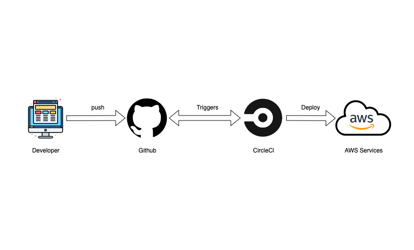

## Pipeline:

There is a pipeline from CI/CD configured with [circleci](https://circleci.com/) by `.circleci/config.yml` file. With the AWS services properly provisioned, the pipeline run the below steps:

1. `npm run frontend:install`
2. `npm run api:install`
3. `npm run frontend:lint`
4. `npm run frontend:build`
5. `npm run api:build`
6. `npm run frontend:deploy`
7. `npm run api:deploy`

The circleci application listens for github repository pushes and perform build and deploy on AWS services:

PS: It's possible to run each command manually and independently from circleci pipeline. 